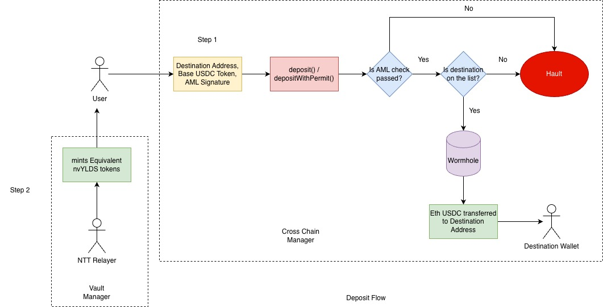
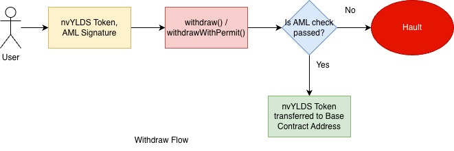
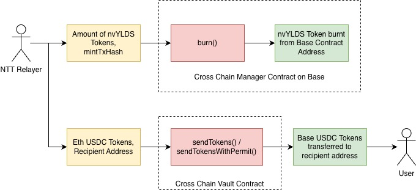

# CrossChainManager Contract

## Overview

The `CrossChainManager` contract is a sophisticated cross-chain token management system that handles token deposits and withdrawals with integrated Anti-Money Laundering (AML) verification. It uses UUPS (Universal Upgradeable Proxy Standard) upgradeability pattern, allowing for secure contract upgrades while preserving state, providing a flexible and compliant way to manage cross-chain token operations.

## Key Features

### 🔐 AML Compliance & Security
- **AML Signature Verification**: Mandatory AML checks for all deposits and withdrawals
- **EIP-712 Typed Data Signing**: Cryptographically secure signature verification
- **Signature Replay Protection**: Prevents reuse of AML signatures
- **Deadline Enforcement**: Time-bound AML signatures to prevent stale authorizations
- **Trusted Signer Model**: Centralized AML verification through trusted signers

### 🌉 Cross-Chain Operations
- **Token Deposits**: Send tokens to other chains via CrossChainVault integration
- **Token Withdrawals**: Handle incoming cross-chain token transfers
- **Permit Integration**: EIP-2612 permit functionality for gasless approvals
- **Multi-Token Support**: Manages both deposit tokens and share tokens

### 🏛️ Access Control & Management
- **Role-Based Permissions**: Granular access control with multiple roles
- **Destination Address Whitelist**: Controlled list of valid destination addresses
- **Burn/Mint Mechanism**: Manual token supply management across chains
- **Two-Step Ownership**: Enhanced ownership transfer security

## Contract Architecture

### Inheritance Structure
```solidity
contract CrossChainManager is
    Initializable,
    UUPSUpgradeable,
    Ownable2StepUpgradeable,
    AccessControlUpgradeable,
    ReentrancyGuardUpgradeable
```

### Core Components

#### State Variables
- `token`: The primary token for deposits
- `crossChainVault`: CrossChainVault contract interface
- `shareToken`: Secondary token for withdrawals
- `amlSigner`: Trusted AML verifier address
- `destinationAddresses`: Array of allowed destination addresses
- `isDestination`: Mapping for destination address validation
- `usedSignatures`: Mapping for signature replay protection

#### Role Definitions
- `BURN_ADMIN_ROLE`: Administrators who can grant burn permissions
- `BURN_ROLE`: Addresses authorized to burn tokens
- `DEFAULT_ADMIN_ROLE`: Contract administrators

## Key Functions

### Deposit Operations



#### `deposit()`
Standard deposit with separate approval:
```solidity
function deposit(
    uint256 _amount,
    address _destinationAddress,
    bytes calldata _amlSignature,
    uint256 _amlDeadline,
    uint16 targetChain,
    uint32 targetDomain,
    ExecutorArgs calldata executorArgs,
    FeeArgs calldata feeArgs
) external payable nonReentrant
```

#### `depositWithPermit()`
Single-transaction deposit with EIP-2612 permit:
```solidity
function depositWithPermit(
    uint256 _amount,
    address _destinationAddress,
    bytes calldata _amlSignature,
    uint256 _amlDeadline,
    uint256 _permitDeadline,
    uint8 _v,
    bytes32 _r,
    bytes32 _s,
    uint16 targetChain,
    uint32 targetDomain,
    ExecutorArgs calldata executorArgs,
    FeeArgs calldata feeArgs
) external payable nonReentrant
```

### Withdrawal Operations



#### `withdraw()`
Standard withdrawal with separate approval:
```solidity
function withdraw(
    uint256 _amount,
    bytes calldata _amlSignature,
    uint256 _amlDeadline
) external nonReentrant
```

#### `withdrawWithPermit()`
Single-transaction withdrawal with EIP-2612 permit:
```solidity
function withdrawWithPermit(
    uint256 _amount,
    bytes calldata _amlSignature,
    uint256 _amlDeadline,
    uint256 _permitDeadline,
    uint8 _v,
    bytes32 _r,
    bytes32 _s
) external nonReentrant
```

### Management Functions

#### Destination Address Management
```solidity
function addDestinationAddress(address _destination, uint16 _targetChain, uint32 _targetDomain) external onlyOwner{}
function removeDestinationAddress(address _destination, uint16 _targetChain, uint32 _targetDomain) external onlyOwner{}
```

#### Configuration Updates
```solidity
function updateCrossChainConfig(address crossChainVaultAddress) external onlyOwner
function updateAmlSigner(address amlSignerAddress) external onlyOwner
```

#### Token Supply Management

```solidity
function burn(uint256 amount, string calldata mintTransactionHash) external onlyRole(BURN_ROLE)
```

## AML Verification Process

### EIP-712 Signature Structure
The contract uses typed data signing for AML verification:

#### Deposit TypeHash
```solidity
keccak256("Deposit(address sender,uint256 amount,address destinationAddress,uint256 deadline)")
```

#### Withdraw TypeHash
```solidity
keccak256("Withdraw(address sender,uint256 amount,address destinationAddress,uint256 deadline)")
```

### Verification Steps
1. **Message Hash Construction**: Creates EIP-712 compliant message hash
2. **Domain Separation**: Uses contract-specific domain separator
3. **Signature Recovery**: Recovers signer address from signature
4. **Authorization Check**: Verifies signer matches trusted AML signer
5. **Replay Protection**: Marks signature as used to prevent reuse
6. **Deadline Validation**: Ensures signature hasn't expired

## Events

### Configuration Events
```solidity
event CrossChainManagerInitialized(
    address indexed tokenAddress,
    address shareTokenAddress,
    address amlSignerAddress,
    address crossChainVaultAddress
);

event CrossChainConfigUpdated(address indexed from, address indexed to);
event AmlSignerUpdated(address indexed from, address indexed to);
```

### Operation Events
```solidity
event Deposited(
    address indexed user,
    uint256 amount,
    address depositToken,
    address shareToken,
    address destinationAddress,
    uint16 targetChain
);

event Withdrawn(
    address indexed user,
    uint256 amount,
    address shareToken,
    address paymentToken
);

event TokensBurned(
    uint256 amount,
    address shareToken,
    address burner,
    string indexed mintTransactionHash
);
```

### Destination Management Events
```solidity
event DestinationAddressAdded(address indexed destination);
event DestinationAddressRemoved(address indexed destination);
event DestinationAddressSkipped(address indexed destination);
```

## Usage Examples

### Initialization
```javascript
const manager = await ethers.getContractFactory("CrossChainManager");
const managerInstance = await manager.deploy();

await managerInstance.initialize(
    tokenAddress,           // Primary token
    shareTokenAddress,      // Share token
    amlSignerAddress,       // Trusted AML signer
    crossChainVaultAddress  // CrossChainVault contract
);
```

### Making a Deposit
```javascript
// Prepare AML signature (off-chain)
const amlSignature = await signAMLDeposit(
    userAddress,
    amount,
    destinationAddress,
    deadline,
    amlSignerPrivateKey
);

// Execute deposit
const tx = await managerInstance.deposit(
    ethers.parseEther("100"),     // Amount
    destinationAddress,            // Destination
    amlSignature,                  // AML signature
    deadline,                      // AML deadline
    targetChain,                   // Target chain
    targetDomain,                  // Target domain
    executorArgs,                  // Executor args
    feeArgs,                       // Fee args
    { value: ethers.parseEther("0.01") } // ETH for fees
);
```

### Making a Withdrawal
```javascript
// Prepare AML signature (off-chain)
const amlSignature = await signAMLWithdrawal(
    userAddress,
    amount,
    destinationAddress,
    deadline,
    amlSignerPrivateKey
);

// Execute withdrawal
const tx = await managerInstance.withdraw(
    ethers.parseEther("50"),      // Amount
    destinationAddress,            // Destination
    amlSignature,                  // AML signature
    deadline                       // AML deadline
);
```

### Using Permit for Gasless Operations
```javascript
// Generate permit signature (off-chain)
const permitSignature = await signPermit(
    tokenAddress,
    userAddress,
    managerAddress,
    amount,
    permitDeadline,
    userPrivateKey
);

// Execute deposit with permit
const tx = await managerInstance.depositWithPermit(
    amount,
    destinationAddress,
    amlSignature,
    amlDeadline,
    permitDeadline,
    permitSignature.v,
    permitSignature.r,
    permitSignature.s,
    targetChain,
    targetDomain,
    executorArgs,
    feeArgs,
    { value: feeAmount }
);
```

## Error Handling

### AML-Related Errors
- `AmlSignatureExpired`: AML signature has expired
- `AmlSignatureAlreadyUsed`: Signature has been used before
- `InvalidAmlSignature`: Invalid signature format
- `InvalidAmlSigner`: Signer not authorized

### Validation Errors
- `InvalidAddress`: Zero address or invalid input
- `InsufficientValue`: Insufficient ETH value for fees
- `AmountMustBeGreaterThanZero`: Amount must be greater than zero
- `InsufficientBalance`: Insufficient contract balance
- `InvalidMintTransactionHash`: Empty transaction hash
- `InsufficientAllowance`: Required token allowance is not met

## Security Features

### Access Control
- **Multi-Role System**: Granular permissions for different operations
- **Two-Step Ownership**: Secure ownership transfer process
- **Role Administration**: Hierarchical role management

### AML Compliance
- **Mandatory Verification**: All operations require AML approval
- **Cryptographic Security**: EIP-712 standard for signatures
- **Replay Protection**: Prevents signature reuse attacks
- **Time-Bound Authorization**: Expiration dates for all signatures

### Upgrade Safety
- **Storage Gaps**: 42 slots reserved for future upgrades
- **UUPS Pattern**: Universal Upgradeable Proxy Standard
- **Controlled Upgrades**: Owner-only upgrade authorization

## Integration Requirements

### Dependencies
- OpenZeppelin Contracts Upgradeable v5.x
- CustomToken contract
- CrossChainVault contract
- EIP-2612 compliant tokens

### External Integrations
- **AML Service**: Off-chain AML verification service
- **CrossChainVault**: For cross-chain token transfers
- **Token Contracts**: ERC20 tokens with permit support

## Deployment Considerations

### Pre-Deployment
1. **AML Signer Setup**: Configure trusted AML verification addresses
2. **Token Contracts**: Deploy and configure token contracts
3. **CrossChainVault**: Deploy and configure vault contract
4. **Destination Addresses**: Prepare list of allowed destinations

### Post-Deployment
1. **Role Assignment**: Grant appropriate roles to addresses
2. **Configuration**: Set AML signer and cross-chain vault
3. **Testing**: Comprehensive testing of all functions
4. **Monitoring**: Set up monitoring for AML compliance

## Best Practices

### AML Signature Management
- Use secure key management for AML signer private keys
- Implement proper signature lifecycle management
- Monitor for signature replay attempts
- Maintain audit trails for all AML verifications

### Destination Address Management
- Regularly review and update destination address lists
- Implement automated compliance checks
- Maintain documentation for address whitelisting decisions

### Token Supply Management
- Implement proper reconciliation processes
- Monitor cross-chain token movements
- Maintain audit trails for burn/mint operations

## Security Audits

This contract should undergo:
- Smart contract security audit
- AML compliance review
- Cross-chain bridge security assessment
- Access control analysis
- Gas optimization review

## License

MIT License - See SPDX-License-Identifier in contract source code.

---

**Note**: This contract is designed for regulated environments requiring AML compliance. Always ensure compliance with local regulations and conduct thorough testing before mainnet deployment.
